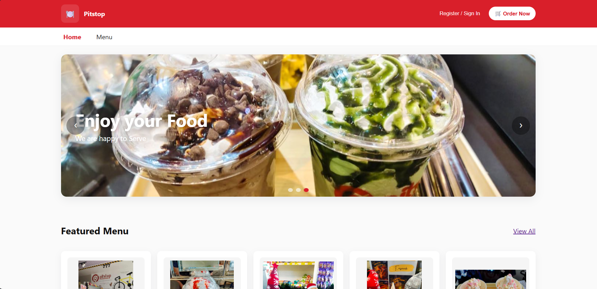
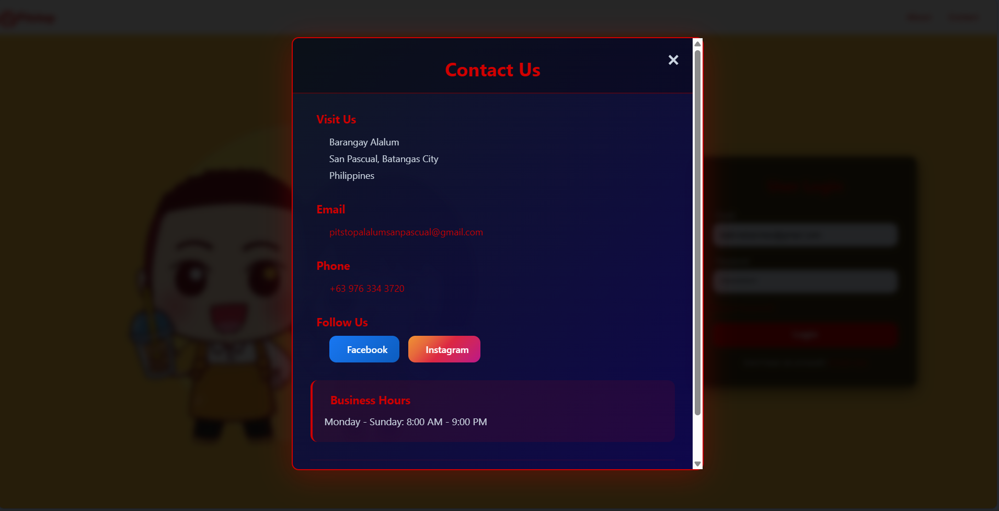
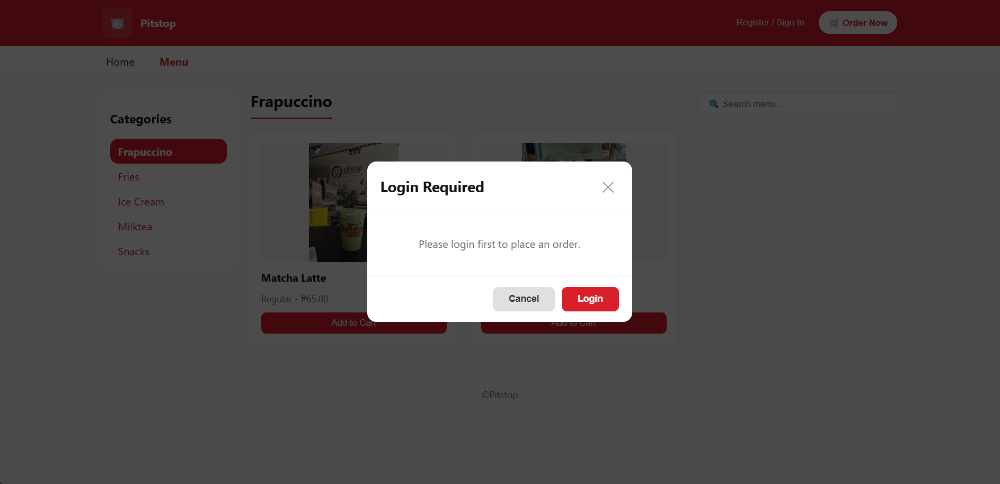
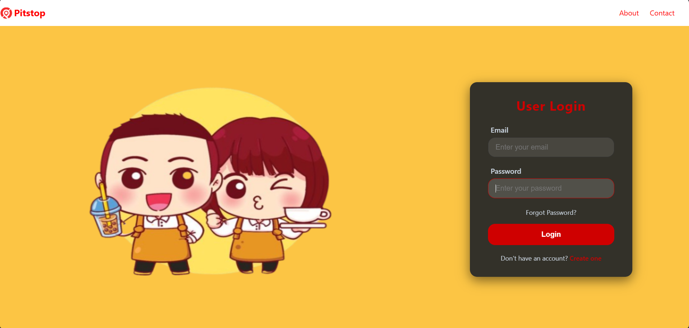
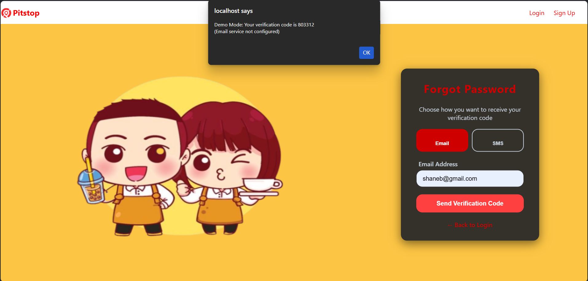
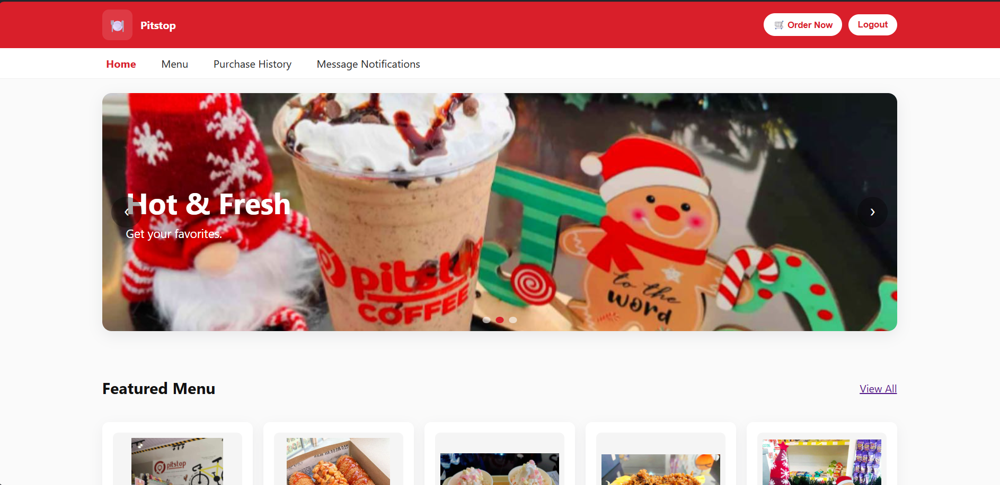
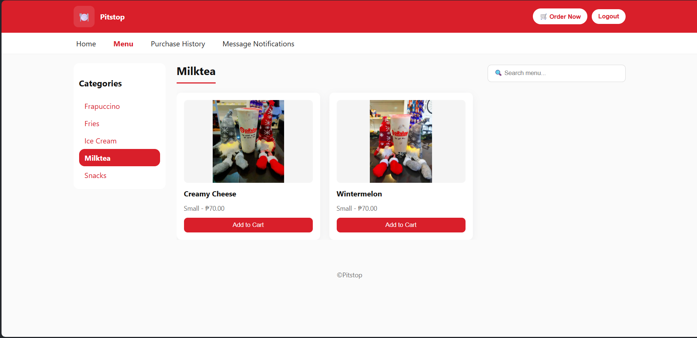
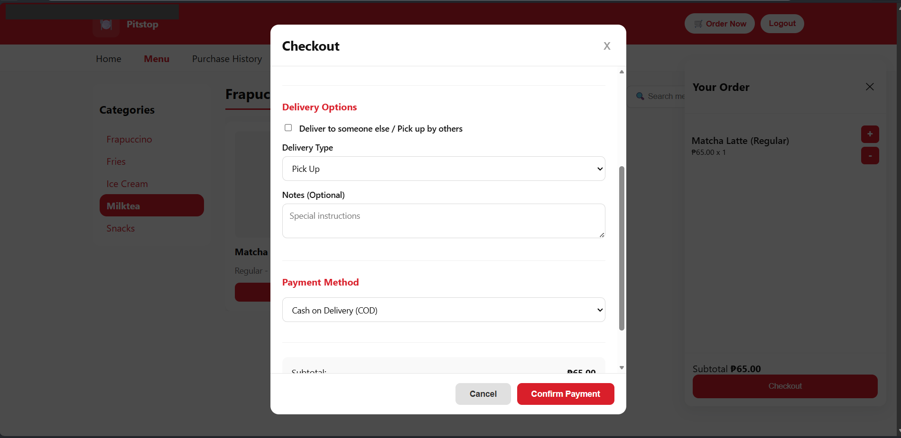
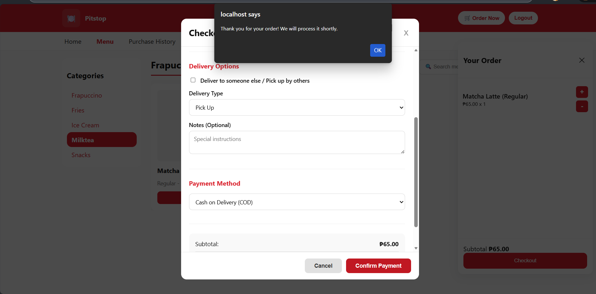

# 🍽️ Pitstop - Food Ordering & Management System

A complete web-based food ordering and restaurant management system featuring a customer ordering interface, admin dashboard with analytics, and real-time order tracking.
---

## 📋 Table of Contents

- [Overview](#-overview)
- [Features](#-features)
- [Screenshots](#-screenshots)
- [Tech Stack](#-tech-stack)
- [Getting Started](#-getting-started)
- [Installation](#-installation)
- [Configuration](#-configuration)
- [Usage Guide](#-usage-guide)
- [File Structure](#-file-structure)
- [Additional Guide](#-additional-guide)
---

## 🎯 Overview

Pitstop is a modern food ordering system designed for restaurants and food businesses. It provides a seamless ordering experience for customers and powerful management tools for administrators. The system includes inventory management, real-time order tracking, sales analytics, and automated stock alerts.

## ✨ Features

### 🛒 Customer Ordering Interface

#### Core Features
- **Dynamic Product Catalog**
  - Browse products by category (Snacks, Fries, Ice Cream, Milktea, Frappuccino, Yogurt Series)
  - Real-time stock availability
  - High-quality product images
  - Search functionality across all products
  
- **Interactive Shopping Cart**
  - Add/remove items with quantity controls
  - Real-time price calculations
  - Stock validation before adding items
  - Persistent cart during session
  
- **Hero Carousel**
  - Auto-playing promotional banners
  - Touch-enabled swipe navigation
  - Clickable dots navigation
  - Responsive image display

- **Featured Products**
  - Dynamically displays top-selling items
  - Based on completed order analytics
  - Automatic fallback to random products

#### Ordering Process
- **Multiple Delivery Options**
  - Pick up from store
  - Delivery to 29 supported barangays
  - Option to deliver to someone else
  - Detailed address input for deliveries
  
- **Payment Methods**
  - Cash on Delivery (COD)
  - GCash (with QR code and receipt upload)
  
- **Order Tracking**
  - Real-time status updates
  - Order history with complete details
  - Push notifications for order changes
  - Delivery personnel information

#### User Management
- **Account System**
  - User registration with email verification
  - Secure login system
  - Password recovery via email (PHPMailer)
  - Logout with confirmation prompt
  
- **User Dashboard**
  - Purchase history
  - Active order notifications
  - Profile information display

---

### 👨‍💼 Admin Dashboard

#### Analytics & Reporting
- **Dashboard Statistics**
  - Today's sales (₱)
  - Total orders today
  - Pending orders count
  - Visual data presentation
  
- **Sales Analytics**
  - Top Selling Products (Doughnut Chart)
  - Daily Sales Trends (Line Chart - Last 7 Days)
  - Sales grouped by date
  - Detailed transaction history
  - Export-ready data format

#### Inventory Management
- **Product Management**
  - Add new products with images
  - Update existing product details
  - Adjust stock quantities
  - Delete products
  - Multiple size variants (Small, Regular, Large)
  - Real-time stock tracking
  - Product image upload (max 5MB)
  
- **Stock Alert System**
  - Automatic low stock detection (< 10 items)
  - Color-coded urgency levels:
    - 🔴 **Out of Stock** (0 items) - Critical with pulsing animation
    - 🟠 **Critical Level** (1-4 items) - Urgent restocking needed
    - 🟡 **Low Stock** (5-9 items) - Warning level
  - Search functionality
  - Summary statistics
  - Sortable tables

#### Order Management
- **Order Processing**
  - Grid-based order display
  - Real-time order updates
  - Status management:
    - Pending
    - Processing
    - Out for Delivery (for delivery orders)
    - Ready for Pickup (for pickup orders)
    - Delivered / Already Picked Up
    - Cancelled
  - Assign delivery personnel
  - View customer details
  - Order items breakdown
  - Payment receipt viewing
  - Special notes from customers

## 📸 Screenshots

### Customer Interface


.png)










### Owner Interface


## 🛠️ Tech Stack

### Frontend
- **HTML5** - Semantic structure
- **CSS3** - Modern styling with:
  - CSS Grid & Flexbox
  - Gradient backgrounds
  - Responsive design
- **JavaScript (ES6+)** - Client-side functionality:
  - Vanilla JavaScript (no frameworks)
  - Async/Await for API calls
  - LocalStorage for user sessions
  - Dynamic DOM manipulation

### Backend
- **PHP 7.4+** - Server-side processing
- **MySQL** - Database management
- **JSON** - API data exchange format
- **PHPMailer** - Email functionality

### Visualization
- **Chart.js** - Interactive charts for admin dashboard

---

## 🚀 Getting Started

### Prerequisites

Before installation, ensure you have:

```
✅ PHP 7.4 or higher
✅ MySQL 5.7 or higher
✅ Apache/Nginx web server
✅ Modern web browser (Chrome, Firefox, Safari, Edge)
✅ Text editor (VS Code)
```

---

## 📥 Installation
### Step 1: Clone the Repository/Download the tar file.


### Step 2: Database Setup

1. **Create MySQL Database**
```sql
CREATE DATABASE pitstop;
```

2. **Import Database Schema**

Use the provided `pitstop.sql` file:

```bash
mysql -u root -p pitstop < pitstop.sql
```

Or import via phpMyAdmin:
- Open phpMyAdmin
- Select the `pitstop` database
- Click "Import"
- Choose `pitstop.sql` file
- Click "Go"

### Step 3: Configure Database Connection

Edit `db.php` with your database credentials:

```php
<?php
$servername = "localhost";
$username = "root";          // Your MySQL username
$password = "";              // Your MySQL password
$dbname = "pitstop";         // Database name

// Create connection
$conn = new mysqli($servername, $username, $password, $dbname);

// Check connection
if ($conn->connect_error) {
    die("Connection failed: " . $conn->connect_error);
}
?>
```

### Step 4: Configure Web Server

#### For Apache (XAMPP/WAMP)

1. Copy project folder to `htdocs`:
```
C:/xampp/htdocs/Pitstop/
```

2. Update API URL in JavaScript files:

**In `ordering.js` (line 1):**
```javascript
const API_URL = 'http://localhost/Pitstop';
```

**In `admin_interface.js` (line 1):**
```javascript
const API_URL = 'http://localhost/Pitstop';
```

3. Access the application:
- Customer Interface: `http://localhost/Pitstop/index.html`
- Admin Panel: `http://localhost/Pitstop/admin.html`

### Step 5: PHPMailer Configuration (Optional)

If using email verification, configure `send_verification.php`:

```php
$mail->Host = 'smtp.gmail.com';
$mail->Username = 'your-email@gmail.com';
$mail->Password = 'your-app-password';
$mail->Port = 587;
```

---

## ⚙️ Configuration

### Delivery Barangays

The system supports delivery to 29 barangays. Edit in `ordering.js`:

```javascript
const barangays = [
    'Alalum', 'Antipolo', 'Balimbing', 'Banaba', 'Bayanan', 
    'Danglayan', 'Del Pilar', 'Gelerang Kawayan', 'Ilat North', 
    'Ilat South', 'Kaingin', 'Laurel', 'Malaking Pook', 
    'Mataas na Lupa', 'Natunuan North', 'Natunuan South', 
    'Padre Castillo', 'Palsahingin', 'Pila', 'Poblacion', 
    'Pook ni Banal', 'Pook ni Kapitan', 'Resplandor', 'Sambat', 
    'San Antonio', 'San Mariano', 'San Mateo', 'Santa Elena', 
    'Santo Niño'
];
```

### Product Categories
Edit categories in `admin_interface.html`:

```html
<select id="productType">
    <option value="Snacks">Snack</option>
    <option value="Fries">Fries</option>
    <option value="Ice Cream">Ice Cream</option>
    <option value="Milktea">Milktea</option>
    <option value="Frapuccino">Frappuccino</option>
    <option value="Yogurt Series">Yogurt Series</option>
    <option value="Others">Others</option>
</select>
```
---

## 📖 Usage Guide

### For Customers

#### 1. Account Creation
1. Open `index.html`
2. Click "Sign Up"
3. Fill in registration form:
   - Full Name
   - Email Address
   - Contact Number
   - Password (min 8 characters)
4. Verify email (if PHPMailer configured)
5. Login with credentials

#### 2. Browse Products
- **Home Page**: View featured best-selling items
- **Menu Page**: Browse all products by category
- **Search**: Use search bar to find specific items
- **Product Details**: View name, size, price, and availability

#### 3. Order Process
1. **Add to Cart**
   - Click on products to add
   - Adjust quantities using +/- buttons
   - View real-time price updates

2. **Checkout**
   - Click "Order Now" button
   - Review cart items
   - Click "Checkout"

3. **Fill Order Details**
   - Customer information (auto-filled from account)
   - Choose delivery type:
     - **Pick Up**: Collect from store
     - **Delivery**: Select barangay (₱30 fee)
   - Optional: Deliver to someone else
   - Add special notes

4. **Payment**
   - **Cash on Delivery**: Pay upon receipt
   - **GCash**: Scan QR code, upload receipt

5. **Confirm Order**
   - Review summary
   - Click "Confirm Payment"
   - Receive order confirmation

#### 4. Track Orders
- **Message Notifications**: View active order status
- **Purchase History**: See completed orders
- **Status Updates**:
  - ⏳ Pending - Order received
  - 🔄 Processing - Being prepared
  - 🚚 Out for Delivery - On the way
  - 🛍️ Ready for Pickup - Ready to collect
  - ✅ Delivered/Picked Up - Complete

---

### For Administrators

#### 1. Owner login
1. Open `admin.html`
2. Enter admin credentials
3. Access admin dashboard

#### 2. Dashboard Overview
- View today's metrics:
  - Total sales (₱)
  - Number of orders
  - Pending orders count
- Analyze charts:
  - Top selling products
  - Sales trends (last 7 days)

#### 3. Product Management

**Add New Product:**
1. Go to "Add Item"
2. Upload product image
3. Enter details:
   - Item name
   - Product type/category
   - Size (Small/Regular/Large)
   - Initial stock quantity
   - Price
4. Click "Add/Update Item"

**Update Existing Product:**
1. Click on product in table
2. Form populates with current data
3. Modify details:
   - To add stock: Enter quantity to add
   - To update price: Change price field
4. Click "Add/Update Item"

**Delete Product:**
1. Select product from table
2. Click "Delete Item"
3. Confirm deletion

#### 4. Stock Management

**Monitor Overall Stocks:**
1. Go to "Overall Stocks"
2. View complete inventory
3. Use search to find products
4. Check stock levels

**Stock Alert System:**
1. Go to "Stock Alert"
2. View low stock items (< 10)
3. Color-coded alerts:
   - 🔴 Out of Stock (0) - Immediate action
   - 🟠 Critical (1-4) - Restock soon
   - 🟡 Low (5-9) - Monitor closely
4. Use to plan restocking

#### 5. Order Processing

**View Orders:**
1. Go to "Order Details"
2. See grid of active orders
3. Each card shows:
   - Order number and date
   - Customer details
   - Delivery information
   - Order items
   - Payment method
   - Total amount

**Update Order Status:**
1. Select order status from dropdown:
   - **For Pickup**: Pending → Processing → Ready for Pickup → Already Picked Up
   - **For Delivery**: Pending → Processing → Out for Delivery → Delivered
2. Assign delivery person (for delivery orders)
3. Click "Update" button

**Handle Special Cases:**
- View customer notes for special instructions
- Cancel orders if needed
- Contact customer using displayed details

#### 6. Sales Reports
1. Go to "Sales" section
2. View completed transactions
3. Sales grouped by date
4. See delivery personnel performance
5. Track payment methods
6. Export data for accounting

---

## 📁 File Structure

```
Pitstop/
│
├── 📄 index.html                    # Landing/Welcome page
├── 📄 ordering.html                 # Customer ordering interface
├── 📄 ordering.css                  # Customer styles
├── 📄 ordering.js                   # Customer JavaScript
│
├── 👤 User Authentication
│   ├── user_login.html              # Customer login
│   ├── signup.html                  # Customer registration
│   ├── signup.css                   # Signup styles
│   ├── forgot_password.html         # Password recovery
│   └── user.css                     # User auth styles
│
├── 👨‍💼 Admin Panel
│   ├── admin.html                   # Owner login
│   ├── admin.js                     # Owner login logic
│   ├── admin_interface.html         # Admin dashboard
│   ├── admin_interface.css          # Admin styles
│   └── admin_interface.js           # Admin functionality
│
├── 🔧 Backend PHP Files
│   ├── db.php                       # Database connection
│   ├── products_get.php             # Get all products
│   ├── products_add.php             # Add/update product
│   ├── products_delete.php          # Delete product
│   ├── orders_get.php               # Get all orders
│   ├── order_submit.php             # Submit new order
│   ├── order_update.php             # Update order status
│   ├── customer_orders.php          # Get customer orders
│   ├── sales_get.php                # Get sales data
│   ├── dashboard_stats.php          # Dashboard statistics
│   ├── delivery_personnel_get.php   # Get delivery staff
│   ├── send_verification.php        # Email verification
│   └── test_db.php                  # Database connection test
│
├── 📦 Database
│   ├── pitstop.sql                  # Database schema
│   └── pitstop.sql.txt              # Schema text backup
│
├── 📂 uploads/                      # Product images directory
│
├── 📧 PHPMailer/                    # Email library
│
├── 🖼️ Images
│   ├── Product Images
│   │   ├── corn dog.jpg
│   │   ├── barbecue_nachos.jpg
│   │   ├── marsmallow_ice cream.jpg
│   │   ├── empanada.jpg
│   │   ├── strawberry_frappucino.jpg
│   │   ├── Matcha_Latte.jpg
│   │   ├── fries.jpg
│   │   └── icecream.jpg
│   │
│   ├── Carousel Images
│   │   ├── display_1.jpg
│   │   ├── display 2.jpg
│   │   └── display_3.jpg
│   │
│   ├── UI Assets
│   │   ├── staff.png                # Admin avatar
│   │   ├── pay.jpg                  # GCash QR code
│   │   ├── background intro.png
│   │   ├── user_login background.png
│   │   ├── topbar_background.png
│   │   └── Pitstop_Front Design.png
│
├── 🎨 Styles
│   ├── style.css                    # Landing page styles
│   └── user.css                     # User interface styles
│
├── 🐛 Debug Tools
│   └── localstorage_debug.html      # LocalStorage viewer
│
└── 📖 README.md                     # This file
```

---

## 🗄️ Database Schema

### Tables Overview

```
📊 Database: pitstop
├── 👤 users                 # Customer accounts
├── 🛡️ admin                 # Admin accounts
├── 📦 products              # Product inventory
├── 🛒 orders                # Customer orders
├── 📝 order_items           # Order details
├── 💰 sales                 # Completed sales
└── 🚚 delivery_personnel    # Delivery staff
```

### Detailed Schema

#### `users` Table
```sql
CREATE TABLE users (
    id INT PRIMARY KEY AUTO_INCREMENT,
    fullname VARCHAR(100) NOT NULL,
    email VARCHAR(100) UNIQUE NOT NULL,
    contact VARCHAR(20) NOT NULL,
    password VARCHAR(255) NOT NULL,
    verification_code VARCHAR(10),
    is_verified BOOLEAN DEFAULT FALSE,
    created_at TIMESTAMP DEFAULT CURRENT_TIMESTAMP
);
```

#### `admin` Table
```sql
CREATE TABLE admin (
    id INT PRIMARY KEY AUTO_INCREMENT,
    username VARCHAR(50) UNIQUE NOT NULL,
    password VARCHAR(255) NOT NULL,
    created_at TIMESTAMP DEFAULT CURRENT_TIMESTAMP
);
```

#### `products` Table
```sql
CREATE TABLE products (
    id INT PRIMARY KEY AUTO_INCREMENT,
    name VARCHAR(100) NOT NULL,
    type VARCHAR(50) NOT NULL,
    size VARCHAR(20) NOT NULL,
    stock INT NOT NULL DEFAULT 0,
    price DECIMAL(10,2) NOT NULL,
    image VARCHAR(255),
    orders INT DEFAULT 0,
    created_at TIMESTAMP DEFAULT CURRENT_TIMESTAMP,
    updated_at TIMESTAMP DEFAULT CURRENT_TIMESTAMP ON UPDATE CURRENT_TIMESTAMP,
    UNIQUE KEY unique_product (name, size)
);
```

#### `orders` Table
```sql
CREATE TABLE orders (
    id INT PRIMARY KEY AUTO_INCREMENT,
    customer_name VARCHAR(100) NOT NULL,
    customer_email VARCHAR(100) NOT NULL,
    customer_contact VARCHAR(20) NOT NULL,
    delivery_type ENUM('pickup', 'delivery') NOT NULL,
    delivery_location VARCHAR(100),
    delivery_address TEXT,
    recipient_name VARCHAR(100),
    payment_method ENUM('cod', 'gcash') NOT NULL,
    receipt_image VARCHAR(255),
    status ENUM('pending', 'processing', 'out_for_delivery', 
                'delivered', 'ready_for_pickup', 
                'already_picked_up', 'cancelled') DEFAULT 'pending',
    delivery_person VARCHAR(100),
    subtotal DECIMAL(10,2) NOT NULL,
    delivery_fee DECIMAL(10,2) DEFAULT 0,
    total DECIMAL(10,2) NOT NULL,
    notes TEXT,
    created_at TIMESTAMP DEFAULT CURRENT_TIMESTAMP,
    updated_at TIMESTAMP DEFAULT CURRENT_TIMESTAMP ON UPDATE CURRENT_TIMESTAMP
);
```

#### `order_items` Table
```sql
CREATE TABLE order_items (
    id INT PRIMARY KEY AUTO_INCREMENT,
    order_id INT NOT NULL,
    product_name VARCHAR(100) NOT NULL,
    product_size VARCHAR(20) NOT NULL,
    quantity INT NOT NULL,
    price DECIMAL(10,2) NOT NULL,
    FOREIGN KEY (order_id) REFERENCES orders(id) ON DELETE CASCADE
);
```

#### `sales` Table
```sql
CREATE TABLE sales (
    id INT PRIMARY KEY AUTO_INCREMENT,
    order_id INT NOT NULL,
    customer_name VARCHAR(100) NOT NULL,
    delivery_location VARCHAR(100),
    payment_method VARCHAR(20) NOT NULL,
    order_status VARCHAR(50) NOT NULL,
    delivery_person VARCHAR(100),
    total DECIMAL(10,2) NOT NULL,
    sale_date TIMESTAMP DEFAULT CURRENT_TIMESTAMP,
    FOREIGN KEY (order_id) REFERENCES orders(id)
);
```

#### `delivery_personnel` Table
```sql
CREATE TABLE delivery_personnel (
    id INT PRIMARY KEY AUTO_INCREMENT,
    name VARCHAR(100) NOT NULL,
    contact VARCHAR(20) NOT NULL,
    status ENUM('active', 'inactive') DEFAULT 'active',
    created_at TIMESTAMP DEFAULT CURRENT_TIMESTAMP
);
```

## 📸 Additional Guide

### Customer Interface Flow
```
Landing Page → Registration → Login → Browse Menu → Add to Cart → Checkout → Track Order
```

### Admin Dashboard Flow
```
Owner login → Dashboard → Manage Products → Process Orders → View Analytics
```

